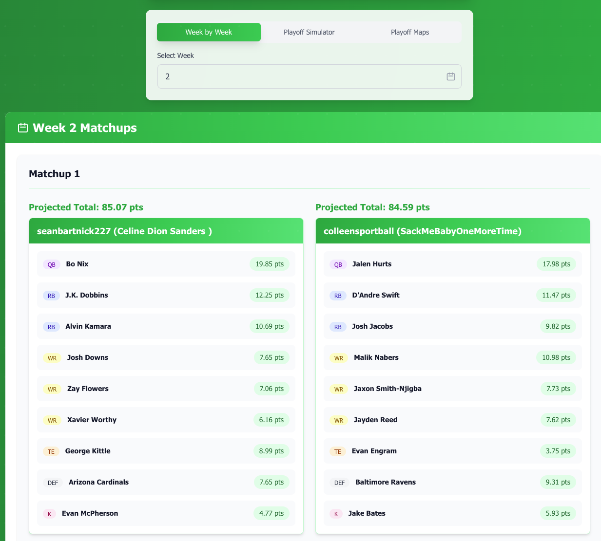
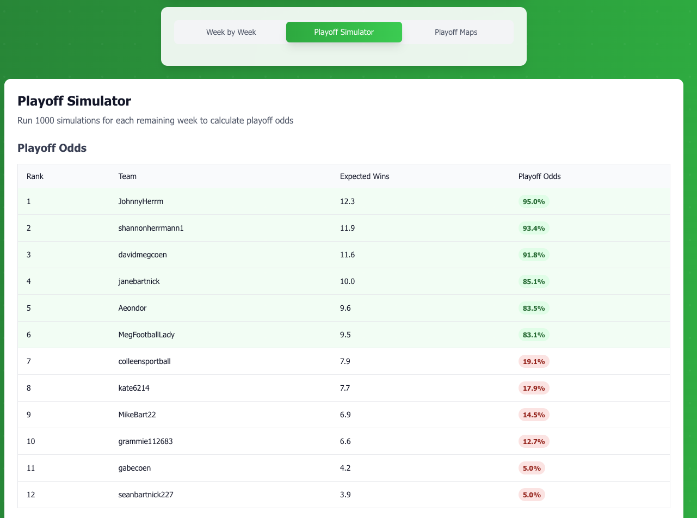

# Fantasy Football League Analyzer

A comprehensive React application for analyzing Sleeper fantasy football league data with advanced roster projections, playoff simulations, and matchup analysis.


## Features

-   **League Search**: Enter a Sleeper league ID to load comprehensive league data
-   **Week-by-Week Analysis**: View detailed matchups with calculated projection totals
-   **Roster Analysis**: Players ordered by position with highest projected points first
-   **Playoff Simulator**: Advanced playoff probability calculations based on win percentages
-   **Playoff Maps**: Visual representation of playoff scenarios and paths
-   **Session Storage**: Persistent user preferences across browser sessions
-   **Responsive Design**: Clean, modern UI built with Tailwind CSS
-   **Real-time Data**: Live updates from Sleeper API and Supabase database

## Screenshots

### Week-by-Week Analysis


_Detailed matchup analysis with roster projections and calculated totals_

### Playoff Simulator


_Advanced playoff probability calculations and scenario modeling_

## Development

### Prerequisites

-   Node.js 18.x or higher
-   npm

### Setup

1. Clone the repository
2. Install dependencies:
    ```bash
    npm install
    ```
3. Start the development server:
    ```bash
    npm run dev
    ```

### Testing

Run the test suite:

```bash
npm run test
```

### Building for Production

Build the application:

```bash
npm run build
```

## Deployment

This application is automatically deployed to GitHub Pages when changes are pushed to the `master` branch.

### Manual Deployment

1. Build the application:
    ```bash
    npm run build
    ```
2. The built files will be in the `dist` directory
3. Deploy the contents of the `dist` directory to your hosting service

## Live Demo

🚀 **[View Live Application](https://yourusername.github.io/league-analyzer/)**

_Note: Replace `yourusername` with your actual GitHub username_

## Usage

1. **Enter League ID**: Input a Sleeper league ID (e.g., `1258107226489360384`)
2. **Select Week**: Choose which week to analyze (1-18)
3. **Explore Features**:
    - **Week-by-Week**: View detailed matchups with roster projections
    - **Playoff Simulator**: Calculate playoff probabilities and scenarios
    - **Playoff Maps**: Visualize playoff paths and outcomes
4. **Persistent Data**: Your selections are automatically saved for the next visit

## Technology Stack

### Frontend Technologies

-   **React 19** - Modern UI framework with hooks and functional components
-   **TypeScript 5.8** - Type-safe JavaScript with static typing
-   **Vite 5.4** - Fast build tool and development server
-   **Tailwind CSS 4.1** - Utility-first CSS framework for styling
-   **Lucide React** - Icon library for UI components

### Backend & Database

-   **Supabase** - Backend-as-a-Service (BaaS) platform
    -   PostgreSQL database
    -   Real-time subscriptions
    -   Authentication system
    -   REST API with auto-generated endpoints
-   **Node.js 18** - JavaScript runtime environment

### External APIs

-   **Sleeper API** - Fantasy football data source
    -   League information
    -   Roster data
    -   Matchup information
    -   Player statistics

### Development Tools

-   **ESLint** - Code linting and style enforcement
-   **Vitest** - Unit testing framework
-   **Testing Library** - React component testing utilities
-   **JSDOM** - DOM implementation for testing

### DevOps & Deployment

-   **GitHub Actions** - CI/CD pipeline automation
-   **GitHub Pages** - Static site hosting
-   **npm** - Package management
-   **Git** - Version control

### Development Environment

-   **ES Modules** - Modern JavaScript module system
-   **Environment Variables** - Configuration management
-   **Session Storage** - Client-side data persistence
-   **Responsive Design** - Mobile-first approach

## Key Features Implemented

-   **Real-time Data Fetching**: Custom React hooks for efficient data management
-   **Type-safe API Integrations**: Full TypeScript coverage for external APIs
-   **Database Operations**: Supabase integration for fantasy player data
-   **Automated Deployment**: CI/CD pipeline with GitHub Actions
-   **Fantasy Analytics**: Advanced projection calculations and playoff simulations
-   **State Management**: React hooks with session storage persistence
-   **Responsive UI**: Mobile-first design with Tailwind CSS
-   **Testing Suite**: Comprehensive unit tests with Vitest and Testing Library

## API Integration

This application integrates with multiple data sources:

### Sleeper API

-   League information and metadata
-   Roster data and player assignments
-   Matchup information and scores
-   User data and team names

### Supabase Database

-   Fantasy player projections and statistics
-   Real-time data synchronization
-   Scalable PostgreSQL backend
-   RESTful API endpoints

## Contributing

1. Fork the repository
2. Create a feature branch
3. Make your changes
4. Submit a pull request

## License

This project is open source and available under the [MIT License](LICENSE).
